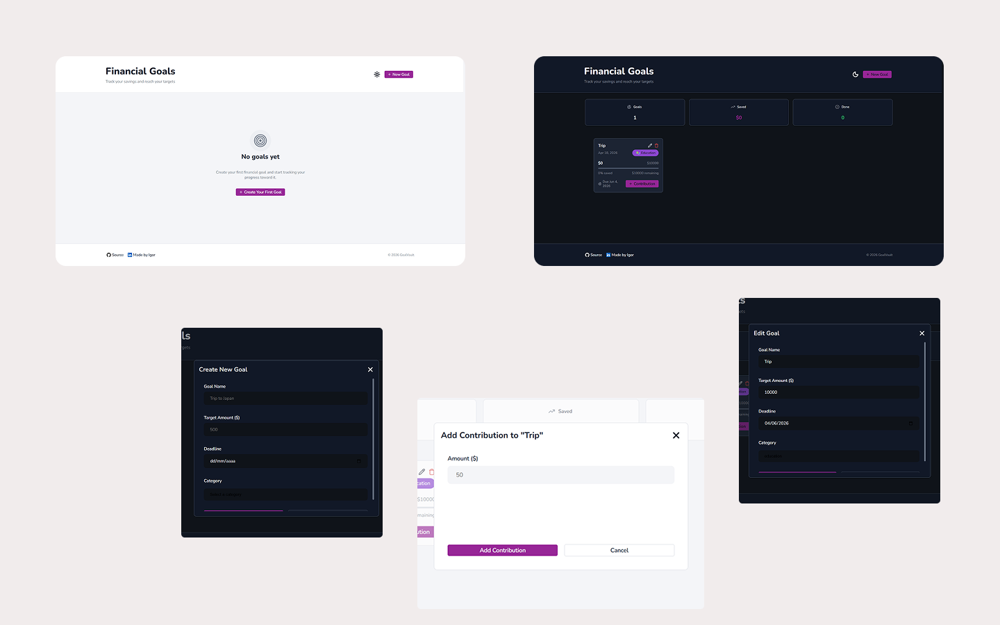

# GoalVault

Manage your goals with GoalVault. Create objectives, track your progress, and stay focused on what truly matters — all in one place.

# Preview

## Live Demo

Access the [Live Demo](https://goal-vault-igor-chaves-demo.vercel.app/) or copy the URL directly: `https://goal-vault-igor-chaves-demo.vercel.app/`

## Cover



# Resources

## Features

- Create, edit, and delete goals
- Track progress toward each goal
- Set target value and deadline for goals
- Switch between light and dark theme
- Persist theme preference with LocalStorage
- Save goal data with IndexedDB

## Technologies

- HTML
- StyledComponents
- JavaScript, TypeScript
- ReactJS, Vite
- React Router
- Redux
- React Hook Form, Yup

## Development support

- Git
- Yarn
- EditorConfig, ESLint, and Prettier
- Lighthouse, PageSpeed Insights

## Extras

- Responsive UI
- Mobile First
- Absolute imports
- SEO
- Deploy on Vercel
- Conventional Commits

# How to use

## Installation

```bash
git clone https://github.com/igorchaves22/goal-vault.git
cd goal-vault
yarn
```

## Running the Project

```bash
yarn dev
```
